# 🛒 AI-Powered Retail Shelf Intelligence Platform

The AI-Powered Retail Shelf Intelligence Platform is an end-to-end Data Analytics, Data Engineering, Machine Learning, and Business Intelligence solution designed to help retail businesses optimize inventory management, improve shelf compliance, reduce stock-outs, detect revenue leakage, and make data-driven decisions.

The platform integrates:

* Data Cleaning & Transformation
* ETL Pipelines
* Data Warehousing
* SQL-Based Business Analytics
* Machine Learning Models
* FastAPI Services
* Power BI Dashboards

This project simulates a real-world retail analytics ecosystem used by modern retail organizations.

---

# 🎯 Business Problem

Retail businesses frequently face:

* Stock-Out Situations
* Overstocking Issues
* Shelf Compliance Violations
* Incorrect Product Placement
* Revenue Leakage
* Pricing Inconsistencies
* Manual Inventory Audits

These issues impact revenue, customer satisfaction, and operational efficiency.

This platform provides a data-driven solution to identify, monitor, and predict such problems.

---

# 🚀 Key Features

## 📊 Data Analytics

* Revenue Analysis
* Category Performance Analysis
* Store Performance Analysis
* Inventory Health Monitoring
* Shelf Compliance Analysis
* Pricing Accuracy Analysis

## ⚙️ Data Engineering

* Data Cleaning
* ETL Pipeline Development
* Feature Engineering
* Data Warehouse Design

## 🤖 Machine Learning

* Demand Forecasting
* Inventory Classification
* Stock Status Prediction

## 🌐 API Development

* FastAPI Implementation
* Demand Prediction Endpoint
* Stock Prediction Endpoint
* Swagger API Documentation

## 📈 Business Intelligence

* Power BI Dashboard
* KPI Monitoring
* Executive Reporting

---

# 🏗️ System Architecture

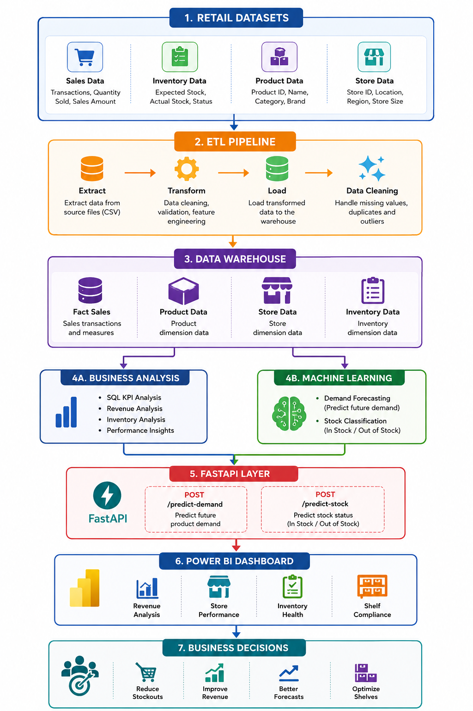

### Workflow

```text
Retail Datasets
      │
      ▼
ETL Pipeline
      │
      ▼
Data Warehouse
      │
 ┌────┴────┐
 ▼         ▼
Business   Machine
Analytics  Learning
 │          │
 └────┬─────┘
      ▼
 FastAPI Layer
      │
      ▼
 Power BI Dashboard
      │
      ▼
Business Decisions
```

---

# 🛠️ Technology Stack

## Programming

* Python

## Data Analysis

* Pandas
* NumPy

## Machine Learning

* Scikit-Learn

## Visualization

* Power BI
* Matplotlib

## Database

* PostgreSQL

## API

* FastAPI
* Uvicorn

## Development

* VS Code
* Jupyter Notebook
* Git
* GitHub

---

# 📂 Project Structure

```text
AI-Powered Retail Shelf Intelligence Platform
│
├── api
├── archives
├── dashboard
├── datasets
├── docs
├── etl
├── models
├── notebooks
├── python
├── reports
├── screenshots
├── sql
├── README.md
└── requirements.txt
```

---

# 📊 SQL Analytics

## Total Revenue

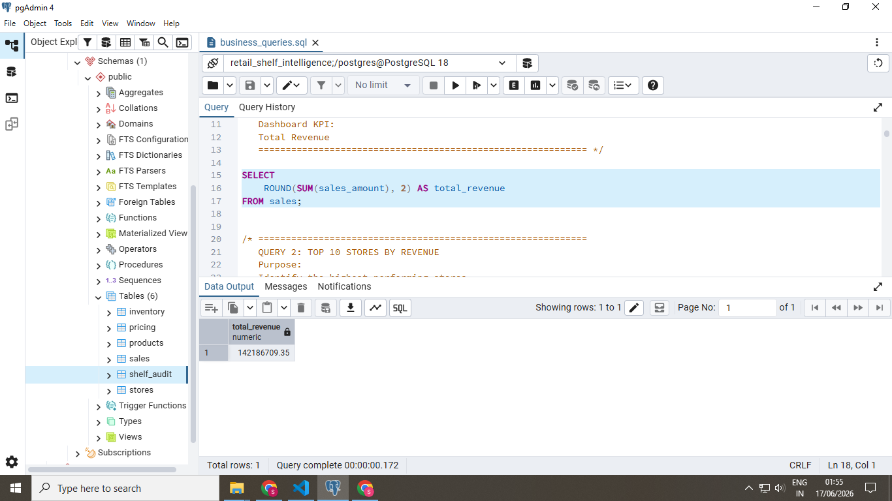

## Top Stores

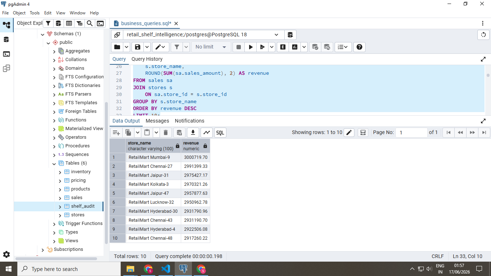

## Revenue Leakage

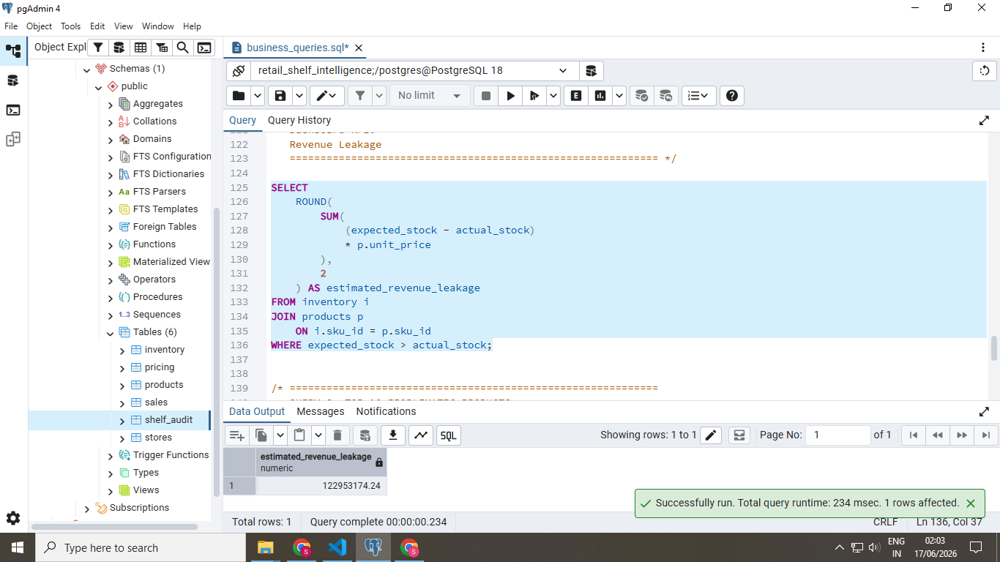

## Shelf Compliance


## Pricing Accuracy

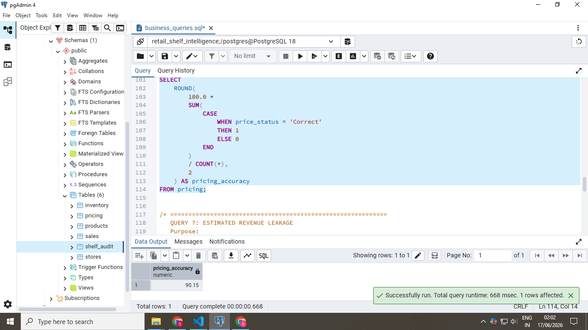

## Stock-Out Analysis

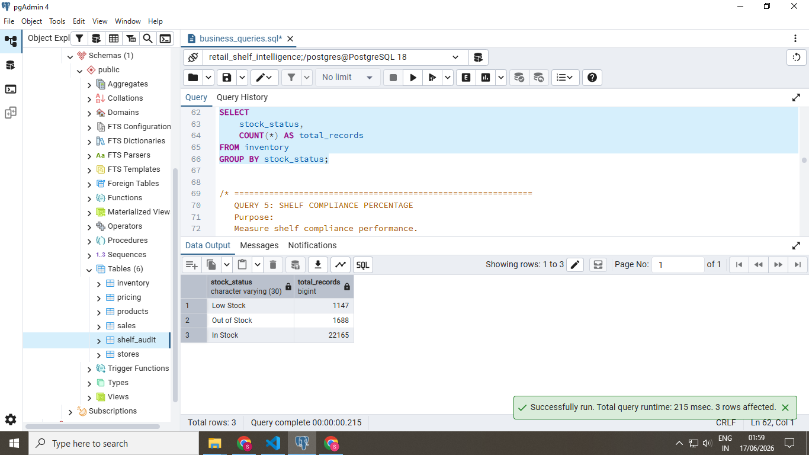

## Problematic Products

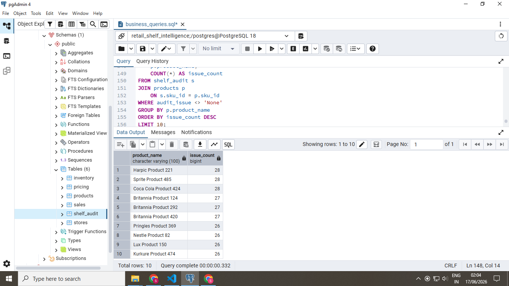

## Category Revenue

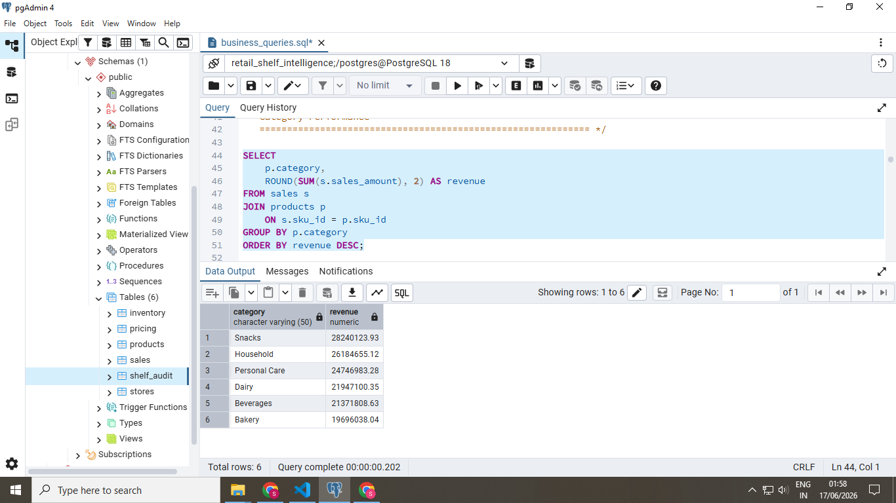

---

# 📈 Power BI Dashboards

## Executive Dashboard

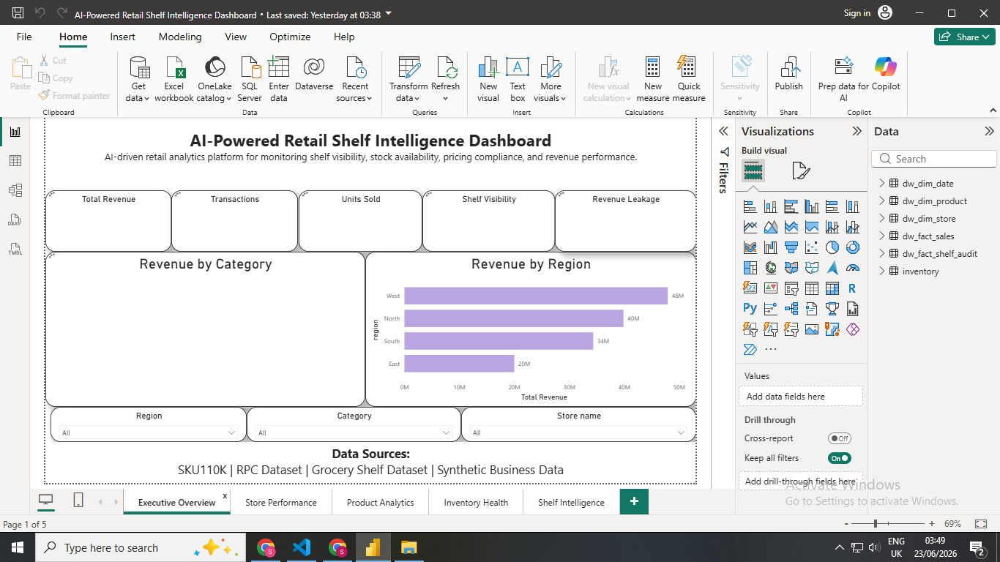

## Store Performance Dashboard

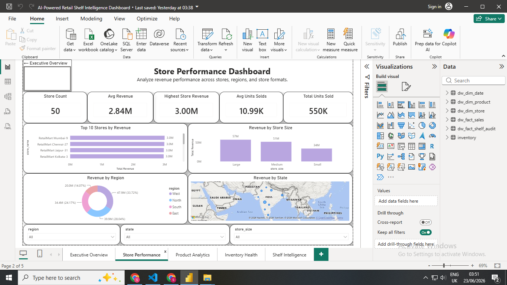

## Inventory Dashboard

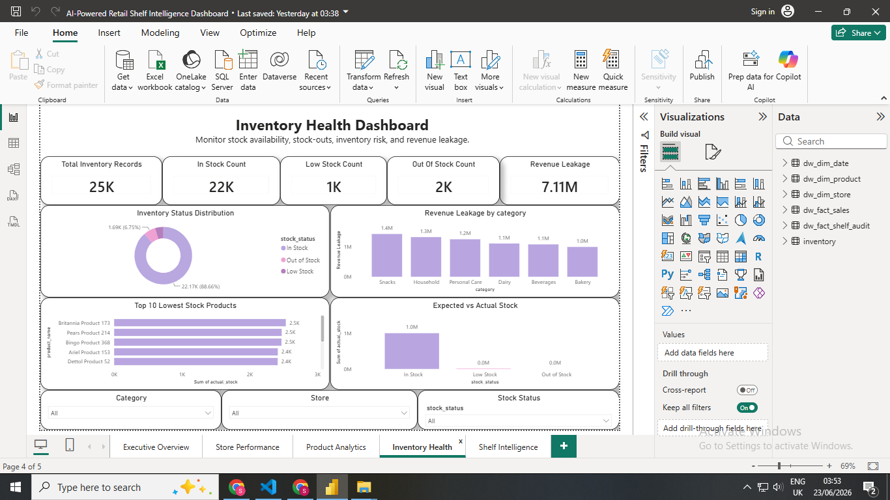

## Shelf Intelligence Dashboard

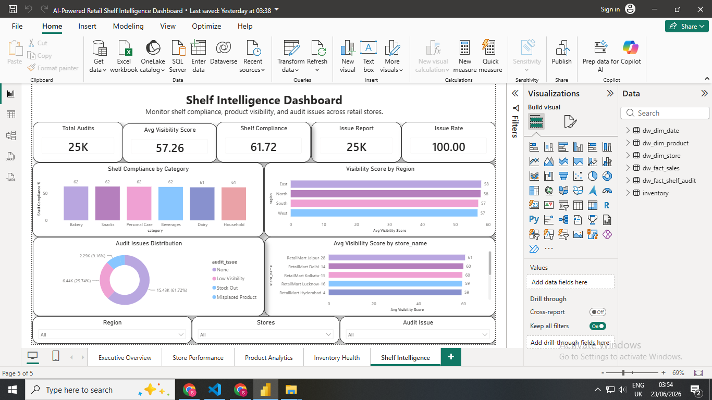

## Revenue Dashboard


---

# 🤖 Machine Learning Models

## Demand Forecasting

Predicts future product demand using historical sales data.


---

## Inventory Classification

Classifies inventory into:

* In Stock
* Low Stock
* Critical Stock


---

## Model Evaluation


---

# 🌐 FastAPI Services

## Swagger Documentation


---

## Demand Prediction Endpoint


---

## Stock Prediction Endpoint


---

# 🗄️ Data Warehouse

The project follows dimensional modeling principles.

### Fact Table

* Fact Sales

### Dimension Tables

* Product Dimension
* Store Dimension
* Inventory Dimension

---

# 🔄 ETL Pipeline

The ETL process performs:

### Extract

* Read raw retail datasets

### Transform

* Data Cleaning
* Missing Value Handling
* Feature Engineering

### Load

* Load processed data into Data Warehouse

---

# 📒 Notebooks

| Notebook                             | Purpose                   |
| ------------------------------------ | ------------------------- |
| 01_data_exploration.ipynb            | Exploratory Data Analysis |
| 02_data_cleaning.ipynb               | Data Cleaning             |
| 03_business_analysis.ipynb           | Business KPI Analysis     |
| 04_feature_engineering.ipynb         | Feature Creation          |
| 05_inventory_analysis.ipynb          | Inventory Insights        |
| 06_shelf_intelligence_analysis.ipynb | Shelf Analytics           |

---

# 🧠 Machine Learning Objectives

### Demand Forecasting

Predict future sales demand.

### Inventory Optimization

Reduce stock-outs and excess inventory.

### Retail Intelligence

Improve product availability and shelf efficiency.

---

# 💼 Business Impact

The platform helps organizations:

* Reduce Inventory Costs
* Minimize Stock-Outs
* Improve Shelf Compliance
* Increase Revenue
* Improve Operational Efficiency
* Support Data-Driven Decision Making

---

# ▶️ How To Run The Project

## 1️⃣ Clone Repository

```bash
git clone <repository-url>
cd AI-Powered-Retail-Shelf-Intelligence-Platform
```

---

## 2️⃣ Install Dependencies

```bash
pip install -r requirements.txt
```

---

## 3️⃣ Run ETL Pipeline

```bash
python etl/run_etl.py
```

---

## 4️⃣ Train Machine Learning Models

```bash
python models/train_model.py
```

---

## 5️⃣ Run FastAPI Server

```bash
python -m uvicorn api.main:app --reload
```

---

## 6️⃣ Open Swagger Documentation

```text
http://127.0.0.1:8000/docs
```

---

## 7️⃣ Open Power BI Dashboard

Open:

```text
dashboard/retail_shelf_intelligence.pbix
```

using Microsoft Power BI Desktop.

---

# 🔮 Future Enhancements

* YOLO-Based Shelf Detection
* OpenCV Shelf Monitoring
* Real-Time Camera Integration
* LLM-Based Retail Insights
* Cloud Deployment
* Automated Alerts
* Mobile Dashboard

---

# 👩‍💻 Author

## Shreya Gupta

Aspiring Data Analyst | Data Science Student

### Skills

Python • SQL • PostgreSQL • Power BI • Machine Learning • FastAPI • ETL • Data Warehousing

---

⭐ If you found this project useful, consider giving it a star.
